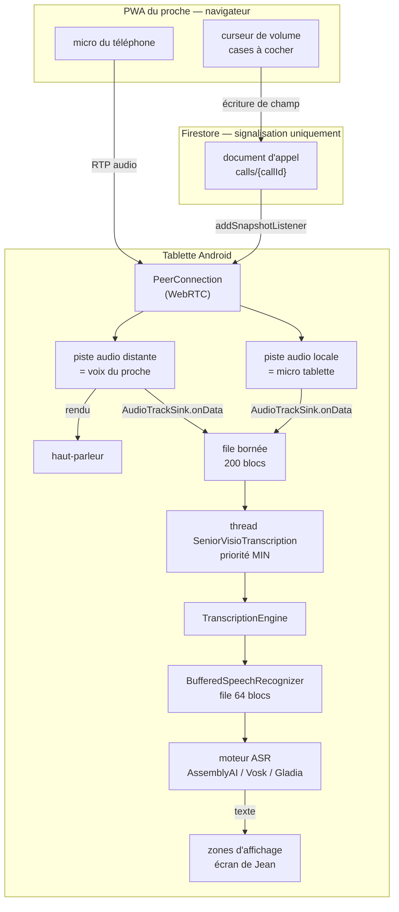
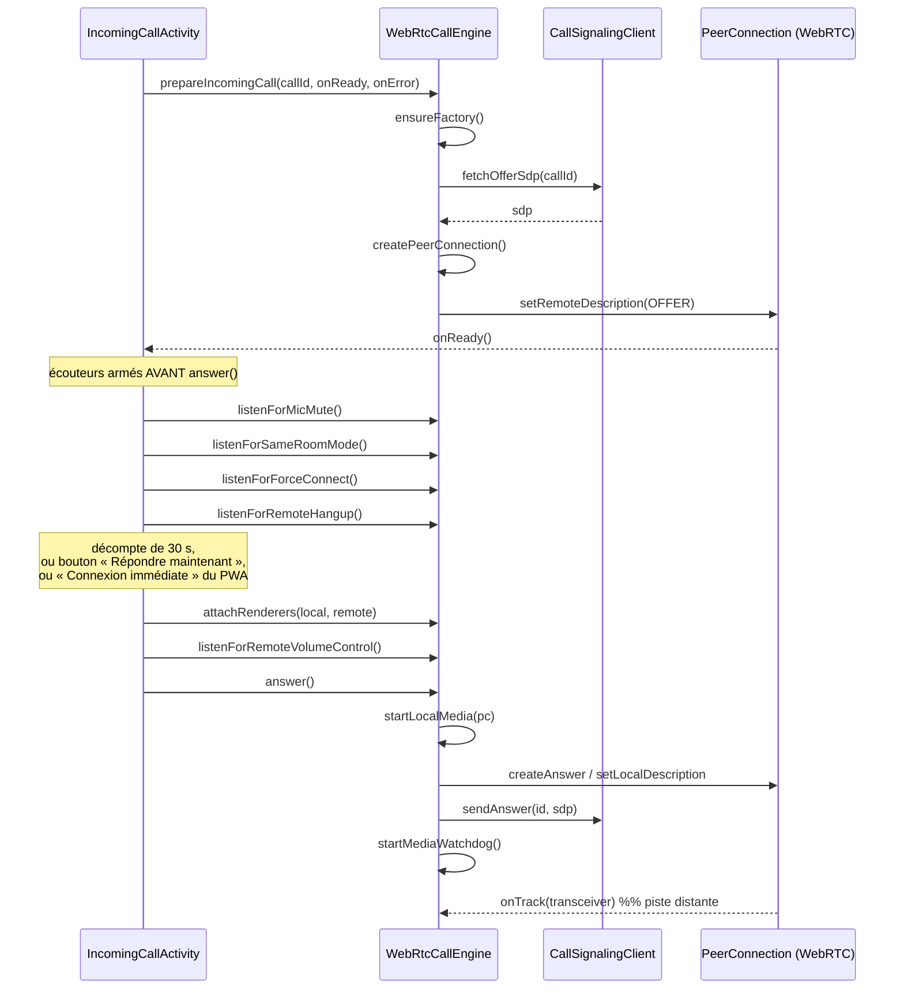

# Senior Visio — architecture du son d'appel et de l'alimentation des transcriptions

**Version du code décrite : rev273** (commit `98d54bb`, branche `AssemblyAI`)
**Dépôt : `jmvfamilly-hash/Seniorvisio`** — module Android `app/`, PWA appelant `web-caller/`

---

## 0. Objet de ce document

Décrire, sans rien supposer connu, **par où passe le son d'un appel** sur la tablette
de Jean et **comment ce son alimente la transcription**. Chaque étape est donnée avec
le fichier, la fonction, et — c'est le point central — **le thread sur lequel elle
s'exécute**.

Ce document existe parce qu'une panne précise résiste : *aucun son sur la tablette au
début d'un appel, aucun effet du curseur de volume, puis le son qui apparaît
exactement à la fin d'un retard d'affichage*. La section 9 énonce cette observation
telle qu'elle a été relevée, et la section 10 sépare ce qui est établi de ce qui reste
hypothèse.

> **Avertissement de fiabilité.** Tout ce qui est marqué **[CODE]** est vérifiable par
> lecture du dépôt. Tout ce qui est marqué **[HYPOTHÈSE]** ne l'est pas et n'a pas été
> mesuré sur l'appareil. Une affirmation antérieure erronée est signalée et corrigée en
> section 10.2.

---

## 1. Le contexte en trois phrases

Senior Visio est une tablette murale posée dans la chambre d'un homme âgé (Jean), et un
PWA que ses proches ouvrent sur leur téléphone pour l'appeler. La règle qui gouverne
tout le produit est **« Jean n'a jamais rien à faire »** : l'appel se connecte seul au
bout d'un décompte, et tous les réglages sont pilotés à distance par le proche.

La tablette **transcrit à l'écran** ce qui se dit, parce que Jean entend mal. Deux
sources possibles de son sont transcrites, jamais les deux à la fois : la voix du
proche reçue par l'appel, ou le microphone de la tablette (ce qui se dit dans la
pièce).

---

## 2. Vue d'ensemble



**Point structurant, et il explique la majeure partie de ce document :** la piste audio
distante a **deux consommateurs** — le haut-parleur et la transcription — et ils
partagent le même thread de livraison. Ce qui retarde l'un retarde l'autre.

---

## 3. Les fichiers, et ce que chacun fait

| Fichier | Rôle |
| --- | --- |
| `app/src/main/java/com/seniorvisio/core/WebRtcCallEngine.kt` | Toute la pile WebRTC côté tablette : pistes, volume, sinks, chien de garde. **Le fichier central de ce document.** |
| `app/src/main/java/com/seniorvisio/signaling/CallSignalingClient.kt` | Lecture/écriture du document Firestore de l'appel. Aucune logique métier. |
| `app/src/main/java/com/seniorvisio/ui/IncomingCallActivity.kt` | L'écran d'appel : décompte, connexion, câblage des écouteurs, affichage du texte. |
| `app/src/main/java/com/seniorvisio/core/TranscriptionEngine.kt` | Aiguillage : une source de son entre, du texte étiqueté sort. Choisit le moteur, gère les sessions. |
| `app/src/main/java/com/seniorvisio/core/BufferedSpeechRecognizer.kt` | Enveloppe qui sort le travail du moteur du fil appelant. **A existé avant la file de la section 6.2 — voir 10.2.** |
| `app/src/main/java/com/seniorvisio/core/SpeechRecognizer.kt` | Le contrat d'un moteur : `start` / `accept` / `stop`. |
| `.../AssemblyAiRealtimeTranscriber.kt`, `.../VoskSpeechRecognizer.kt`, `.../GladiaStreamingTranscriber.kt` | Les trois moteurs. |
| `app/src/main/java/com/seniorvisio/core/Pcm16.kt` | Conversion PCM : multicanal → mono, rééchantillonnage vers 16 kHz. |
| `app/src/main/java/com/seniorvisio/core/CallTrace.kt` | Journal technique **sans donnée personnelle**, publié en clair. |
| `app/src/main/java/com/seniorvisio/core/TranscriptionTrace.kt` | Journal **chiffré** : contient le texte reconnu, donc de la parole. |
| `web-caller/webrtc-engine.js` | Pendant navigateur : offre SDP, écriture des consignes. |

---

## 4. Établissement de l'appel — la séquence exacte

Le proche appelle depuis le PWA, qui crée le document Firestore et y dépose son offre
SDP. Sur la tablette, un service de premier plan permanent détecte l'appel et lance
`IncomingCallActivity`.



**L'ordre des écouteurs n'est pas cosmétique.** `listenForMicMute`,
`listenForSameRoomMode` et `listenForRemoteVolumeControl` sont armés **avant**
`answer()`, parce que les pistes audio appliquent ces consignes **à leur création**.
Un écouteur armé après coup laisse passer un aller-retour Firestore pendant lequel la
tablette émet ou diffuse ce qu'elle ne devrait pas — assez pour un larsen franc quand
le téléphone du proche est dans la pièce. **[CODE]**

---

## 5. Le son, dans les deux sens

### 5.1 Sortant — le micro de la tablette vers le proche

`WebRtcCallEngine.startLocalMedia(pc)` **[CODE]** :

1. Vérifie les permissions `CAMERA` et `RECORD_AUDIO` ; sort en silence sinon.
2. `configureAudioForCall()` — force `MODE_IN_COMMUNICATION` et le haut-parleur
   principal, sauvegarde l'état audio précédent, puis `pinSystemVolume()`.
3. `startTranscriptionWorker()` — démarre le thread consommateur (section 6.2).
4. `factory.createAudioTrack("SVIO_AUDIO", …)`.
5. **`audioTrack.setEnabled(!pendingMicMuted && !sameRoomMode)`** — les deux consignes
   comptent dès la création.
6. `attachTranscriptionSink(audioTrack, TranscriptionSource.ROOM)`.
7. `pc.addTrack(audioTrack, …)`.

### 5.2 Entrant — la voix du proche vers le haut-parleur

Dans `createPeerConnection()`, le rappel `onTrack` **[CODE]** :

```kotlin
override fun onTrack(transceiver: RtpTransceiver?) {
    val track = transceiver?.receiver?.track()
    if (track is VideoTrack) { … }
    else if (track is AudioTrack) {
        remoteAudioTrack = track
        CallTrace.record("APPEL onTrack", "…")
        volumeHandler.post { applyVolumeNow() }   // ← repasse sur le thread principal
        startTranscriptionWorker()
        attachTranscriptionSink(track, TranscriptionSource.CALL)
    }
}
```

`onTrack` s'exécute sur **le thread de signalisation de WebRTC**, pas sur le thread
principal. C'est pourquoi le volume n'y est plus posé directement : il est renvoyé au
seul thread autorisé à toucher au volume, faute de quoi une rampe en cours et cette
pose s'écrasent mutuellement selon laquelle finit la dernière. **[CODE]**

---

## 6. Le chemin du volume — deux chemins pour un curseur

### 6.1 De bout en bout

```
curseur du PWA (0 à 200 %, pas de 5)
   └─ app.js : « input » anti-rebond 150 ms
       └─ webrtc-engine.js : setRemoteVolume(v)  →  callDoc.update({ remoteVolume: v })
           └─ Firestore
               └─ CallSignalingClient.listenForRemoteVolume → snapshot.getDouble("remoteVolume")
                   └─ WebRtcCallEngine.listenForRemoteVolumeControl
                       └─ pendingVolume = v ; rampVolumeTo(v)
```

`rampVolumeTo(requested)` **[CODE]** :

| Étape | Effet |
| --- | --- |
| `target = if (sameRoomMode) 0.0 else requested` | le mode même pièce prime sur le curseur |
| `applySystemVolume(target)` | **posé d'un coup** sur `STREAM_VOICE_CALL` |
| si `remoteAudioTrack == null` | la consigne reste dans `pendingVolume`, appliquée à l'arrivée de la piste par `applyVolumeNow()` |
| sinon | rampe de 20 paliers × 60 ms sur `track.setVolume(…)` |

`applySystemVolume(requested)` : `level = round(max × 0.7 × min(requested, 1.0))`.
Zéro coupe le flux ; 100 % redonne le niveau historique ; au-delà le flux ne bouge
plus et seul le gain numérique monte.

### 6.2 Pourquoi deux chemins

`AudioTrack.setVolume` est un gain logiciel appliqué par la pile WebRTC. **La méthode
ne rend rien, ne lève rien, ne journalise rien** : si elle n'a aucun effet sur un
appareil donné, aucune ligne de code ne peut s'en apercevoir. Le flux
`STREAM_VOICE_CALL`, lui, est le même réglage que les boutons physiques et échoue
bruyamment. Le curseur agit désormais sur les deux. **[CODE]**

---

## 7. L'alimentation de la transcription — le cœur du sujet

### 7.1 Les deux sinks

`attachTranscriptionSink(track, source)` est appelé **deux fois** : sur la piste locale
avec `ROOM`, sur la piste distante avec `CALL`. **[CODE]**

```kotlin
track.addSink(object : AudioTrackSink {
    override fun onData(audioData: ByteBuffer, bitsPerSample: Int, sampleRate: Int,
                        numberOfChannels: Int, numberOfFrames: Int,
                        absoluteCaptureTimestampMs: Long) {
        val bytes = ByteArray(audioData.remaining())
        audioData.duplicate().get(bytes)
        enqueueForTranscription(PcmBlock(source, bytes, sampleRate, numberOfChannels))
    }
})
```

`onData` livre des blocs de **10 ms** et s'exécute sur un thread temps réel de WebRTC :
le fil de **capture** pour la piste locale, le fil de **rendu** pour la piste distante.
Le second est celui qui alimente le haut-parleur.

### 7.2 La file de `WebRtcCallEngine` (ajoutée en rev273)

```
onData ──► enqueueForTranscription ──► ArrayBlockingQueue<PcmBlock>(200)
                                            │
                                            ▼
                              thread « SeniorVisioTranscription »
                                   priorité Thread.MIN_PRIORITY
                                            │
                                            ▼
                              TranscriptionEngine.feed(...)
```

Règles de cette file **[CODE]** :

- **Bornée à 200 blocs** ≈ 2 secondes de son.
- **Ne bloque jamais le producteur.** Pleine : `poll()` jette le plus ancien, puis
  `offer()`. Jamais de `put()`.
- L'arbitrage est tranché d'avance : *si le moteur est plus lent que le temps réel, la
  voix du proche passe avant sa transcription.*
- Le temps passé dans `feed` est chronométré ; au-delà de **50 ms pour 10 ms de son**,
  `CallTrace` écrit `moteur lent : N ms pour 10 ms de son, M blocs en attente`.
- `startTranscriptionWorker` / `stopTranscriptionWorker` sont `@Synchronized` : le
  démarrage est demandé depuis deux threads différents.

### 7.3 `TranscriptionEngine.feed` — ce qu'il fait, dans l'ordre

Appelé désormais depuis le thread de travail. **[CODE]**

1. `reportedSources.add(source)` → un diagnostic « son reçu » la première fois.
2. **`if (source != activeSource) return`** — tout le son des sources inactives est
   jeté ici. Les deux sinks alimentent en permanence ; un seul compte.
3. `resolveEngine(source)` → lit `AdminConfig` (`roomEngine` / `callEngine`), applique
   le mode « bascule » et résout `AUTO` vers Vosk.
4. Si le moteur en cours diffère du moteur voulu **et** que le voulu est disponible →
   `stopSession()`.
5. `remember(Block(...))` → dépose dans le **pré-roll** (2 s glissantes).
6. `levelOf(pcm16)` → valeur efficace ; met à jour `lastSoundAtMs` si ≥ `SILENCE_LEVEL`.
7. Si silence > `BILLED_SILENCE_MS` **et** moteur facturé → `stopSession()`, et on ne
   rouvre pas sur du silence.
8. Si une session tourne → `recognizer.accept(...)` et retour.
9. Sinon → `createRecognizerFor(wanted)`, `UsageStats.noteTranscriptionStart(...)`,
   `created.start(onText, onError)`, puis **`flushPreRollInto(created)`** — les deux
   dernières secondes partent en premier, c'est-à-dire l'attaque de la phrase, dite
   pendant que la session était fermée.

### 7.4 `BufferedSpeechRecognizer` — la seconde file

Chaque moteur est enveloppé par `buffered(...)`. **[CODE]**

| Propriété | Valeur |
| --- | --- |
| Capacité | 64 blocs (≈ 2 s) |
| Débordement | jette le plus ancien |
| Thread | `SeniorVisio-Transcription`, priorité `NORM` |
| Attente | `poll(200 ms)` — bornée, pour que `stop()` n'attende pas un bloc qui ne viendra pas |
| `stop()` | `interrupt()` puis **`join(500 ms)`** |

C'est elle qui sort du fil appelant le rééchantillonnage et l'écriture réseau.

> **`stop()` peut donc bloquer son appelant jusqu'à 500 ms**, et `stopSession()` est
> appelé depuis `feed`. Avant rev273, cet appelant était un thread temps réel de
> WebRTC. C'est le seul blocage long établi par lecture sur ce chemin. **[CODE]**

### 7.5 Les moteurs

| Moteur | Nature | Facturé à la durée | Remarque |
| --- | --- | --- | --- |
| `ASSEMBLYAI` | WebSocket `wss://streaming.assemblyai.com/v3/ws` | **oui** | `accept` : `Pcm16.toMono16k` puis accumulation jusqu'à `MIN_CHUNK_BYTES`, puis trame binaire |
| `VOSK` | embarqué, natif, hors-ligne | non | modèle téléchargé une fois ; `Recognizer(model, 16000f)` créé au premier bloc |
| `GLADIA` | WebSocket | oui | alternative |
| `ANDROID` | `SpeechRecognizer` du système | non | **ne peut pas servir ici** : il écoute le micro lui-même et n'accepte pas de PCM. `createRecognizerFor` le remplace et le dit dans le diagnostic. |

Deux garde-fous : `quotaExhausted` (plafond mensuel, repli sur Vosk) et le repli sur
AssemblyAI tant que le modèle Vosk n'est pas téléchargé.

### 7.6 Qui décide de la source

```kotlin
private fun applyTranscriptionSource() {
    transcription.setActiveSource(
        when {
            !captionsActive -> null                    // sous-titres éteints
            micToRoom       -> TranscriptionSource.ROOM // « écouter la pièce »
            else            -> TranscriptionSource.CALL
        }
    )
}
```

`setActiveSource` ferme la session en cours à chaque changement. **Une seule session à
la fois, jamais deux** — question de coût, mais surtout de sens : deux textes
simultanés demanderaient à Jean de choisir lequel lire. **[CODE]**

---

## 8. Le modèle de threads — le tableau qui résume tout

| Thread | Qui le crée | Ce qui s'y exécute | Contrainte |
| --- | --- | --- | --- |
| **Rendu audio WebRTC** | pile WebRTC | `onData` de la piste **distante** | temps réel — **alimente le haut-parleur** |
| **Capture audio WebRTC** | pile WebRTC | `onData` de la piste **locale** | temps réel — alimente ce que le proche entend |
| **Signalisation WebRTC** | pile WebRTC | `onTrack`, `onIceConnectionChange`, `getStats` | ne pas bloquer |
| **Principal (UI)** | Android | rappels Firestore, rampes de volume, chien de garde, affichage | une exception non rattrapée **tue le processus** |
| **`SeniorVisio-AudioQueue`** (MIN) | `WebRtcCallEngine`, rev273 | `TranscriptionEngine.feed` | peut être lent, c'est son rôle |
| **`SeniorVisio-Transcription`** (NORM) | `BufferedSpeechRecognizer` | `accept` du moteur : rééchantillonnage, réseau, décodage Vosk | peut être lent |

**Trois conséquences pratiques :**

1. Les champs partagés entre ces threads sont `@Volatile` dans `WebRtcCallEngine`
   (`remoteAudioTrack`, `localAudioTrack`, `sameRoomMode`, `pendingVolume`,
   `pendingMicMuted`). Sans cela, `onTrack` pouvait décider du volume sur une valeur
   périmée indéfiniment.
2. Les rappels Firestore sont enveloppés dans `CallTrace.guard(...)`, qui journalise
   l'exception au lieu de la laisser tuer le processus. Un appel qui s'interrompt au
   moment précis où le proche coche une case ressemble exactement à ça.
3. `TranscriptionEngine` n'est **pas** thread-safe (`preRoll`, `reportedSources`,
   `recognizer` sont des champs nus). Il était appelé depuis les deux threads temps
   réel simultanément ; le thread de travail unique les sérialise désormais.

---

## 9. Le chemin retour du texte

```
moteur ASR
  └─ onText(text, isFinal)
      └─ TranscriptionEngine  → étiquette avec la source qui l'a produit
          └─ WebRtcCallEngine.transcriptionOnText
              └─ IncomingCallActivity.listenForCaptions { source, text, isFinal -> }
                  ├─ ROOM → zone 2
                  └─ CALL → zone 3
                      └─ RollingCaptionZone : affichage cadencé à la vitesse de lecture
                          └─ publishScreenState → Firestore → réplique dans le PWA
                                                   dont « secondes de retard »
```

**Le « retard » affiché dans le PWA est `RollingCaptionZone.pendingSeconds`** : les mots
déjà transcrits mais pas encore montrés, parce que l'affichage est volontairement
cadencé pour que Jean ait le temps de lire. Ce retard est **voulu**, et c'est lui qui
apparaît dans l'observation de la section 10.

`stopSession()` émet `onText(source, "", true)` pour clore le segment en attente, sans
quoi la phrase suivante écraserait la précédente en croyant la corriger.

---

## 10. La panne en cours — état exact de l'enquête

### 10.1 L'observation, telle que relevée sur l'appareil

> Le son ne marche pas au démarrage. Quels que soient les manipulations sur le curseur
> ou la coche « même pièce », rien ne se passe. Par contre, après une phrase longue du
> proche qui provoque du retard côté affichage chez Jean (secondes de retard affichées
> côté PWA), **à la fin de ce retard exactement**, le son s'entend côté tablette.
> Comportement reproductible.

Trois faits à expliquer conjointement :

1. Silence total au début de l'appel.
2. **Aucun** réglage n'y change quoi que ce soit — ni le gain de la piste, ni le volume
   système, ni la coupure même pièce.
3. Le son démarre à un instant corrélé à la fin du drainage du retard d'affichage, de
   façon reproductible.

Le fait n° 2 est le plus discriminant : il écarte toute explication en termes de
**niveau**. Un niveau mal posé se corrige en bougeant le curseur. Ce qui ne se corrige
par aucun réglage, c'est une chaîne qui ne délivre pas d'échantillons.

### 10.2 Correction d'une affirmation erronée de ma part

Le message du commit `98d54bb` affirme que `feed`, exécuté sur le thread de rendu,
enchaînait « un envoi WebSocket ou le décodage natif de Vosk ».

**C'est faux, et je l'ai écrit sans avoir lu `BufferedSpeechRecognizer.kt`.** Cette
enveloppe existait déjà et sortait précisément ces deux opérations du fil appelant. Sa
documentation décrit d'ailleurs le même raisonnement que celui que j'ai cru tenir pour
la première fois.

Ce qui restait réellement sur le thread de rendu avant rev273, vérifié par lecture :

| Opération | Coût | Fréquence |
| --- | --- | --- |
| `AdminConfig(context)` — jusqu'à 3 constructions | `getSharedPreferences`, mis en cache par Android | **chaque bloc (100/s)** |
| `levelOf(pcm16)` — valeur efficace | boucle sur ~480 à 960 échantillons | chaque bloc |
| `remember(...)` — pré-roll | insertion + purge sur `ArrayDeque` | chaque bloc |
| `UsageStats.monthlySecondsFor` | `prefs.getInt` sous verrou | au changement de moteur |
| `createRecognizerFor` + `start` | `VoskModelProvider.getModel()`, création client réseau | à l'ouverture de session |
| **`stopSession()` → `BufferedSpeechRecognizer.stop()` → `join(500 ms)`** | **jusqu'à 500 ms bloquantes** | à chaque silence > 6 s, moteur facturé |
| `flushPreRollInto` | jusqu'à 200 `accept()` (simples dépôts en file) | à l'ouverture de session |

**Conclusion honnête :** la file de rev273 est justifiée — aucune de ces opérations n'a
sa place sur un fil temps réel, et le `join(500 ms)` est un blocage long avéré. Mais
**ce relevé n'explique pas à lui seul un silence total et permanent**. Il explique des
hoquets et un retard, pas une absence.

### 10.3 Ce qui est établi / ce qui ne l'est pas

**Établi par lecture du code [CODE]**

- La piste distante alimente le haut-parleur **et** la transcription depuis le même
  thread de livraison.
- `stopSession()` pouvait bloquer ce thread jusqu'à 500 ms, et était appelé depuis
  `feed`.
- `AudioTrack.setVolume` ne peut pas signaler son échec.
- Les champs d'état partagés n'étaient pas `@Volatile` avant rev272.
- `pendingMicMuted` n'était pas remis à zéro par `cleanup()` avant rev269 : une coupure
  micro demandée une fois survivait à tous les appels suivants jusqu'au redémarrage.

**Non établi, non mesuré [HYPOTHÈSE]**

- Que le blocage du fil de rendu soit la cause du silence **total**. Plausible mais
  non démontré ; la corrélation avec la fin du retard d'affichage reste sans mécanisme
  identifié.
- Que `track.setVolume` fonctionne ou non sur cette tablette précise. **C'est la
  première chose à trancher.**
- L'arrêt brutal de l'appel au clic « même pièce », signalé séparément et jamais
  expliqué.

### 10.4 Pistes non encore explorées — pour un examen extérieur

À l'intention de qui reprendrait ce dossier, voici ce qui n'a **pas** été vérifié :

1. **Le `AudioDeviceModule` n'est pas configuré explicitement.** Un commentaire du
   fichier indique qu'un `JavaAudioDeviceModule` avec annulation d'écho matérielle
   avait été essayé puis retiré, ayant *fait apparaître* un écho. La configuration
   actuelle est donc celle par défaut. **Quel module de sortie est réellement utilisé,
   et dans quel mode, n'a jamais été relevé.**
2. **`MODE_IN_COMMUNICATION` + `setSpeakerphoneOn(true)`** est posé dans
   `configureAudioForCall()`. `isSpeakerphoneOn` est déprécié depuis Android 12 et la
   tablette tourne sous Android 36. Le routage effectif n'a pas été vérifié.
3. **L'interaction avec `RoomPresenceService`**, qui ouvre un `AudioRecord`
   (`MediaRecorder.AudioSource.MIC`) pour écouter la pièce. Un commentaire affirme que
   cette écoute est suspendue dès la demande de connexion ; **cela n'a pas été vérifié
   sur l'appareil.** Deux consommateurs du micro et un mode audio en communication
   forment une combinaison connue pour des effets de routage.
4. **`STREAM_VOICE_CALL` sur une tablette sans radio cellulaire.** Ce flux est prévu
   pour la téléphonie. Sur un appareil qui n'en a pas, son comportement — et
   l'existence même d'un niveau non nul — n'est pas garanti. **Piste sérieuse pour un
   silence total insensible à tous les réglages.**
5. Le premier chargement du modèle Vosk et sa durée réelle.

### 10.5 Ce que le prochain appel produira

`CallTrace` est **toujours actif**, en clair, sans clé ni interrupteur, publié toutes
les 20 secondes dans `devices/jean_tablet/diag/journal-appel`, et lisible d'un bouton
dans le panneau d'administration du PWA. Lignes attendues :

```
APPEL préparation      | callId=…
APPEL answer           | consigneVolume=1.0 microCoupé=false mêmePièce=false
APPEL audio système    | mode précédent=0 … → fixé à 5/7
APPEL micro tablette   | piste créée — actif=true (…)
APPEL onTrack          | piste audio du proche reçue — mêmePièce=false consigne=1.0
APPEL volume           | niveau 1.0 posé sur la piste distante
APPEL volume système   | consigne=1.0 → flux 5/7 (plafond 0.7)
APPEL flux entrant     | premiers octets reçus du proche (N)
APPEL transcription    | moteur lent : N ms pour 10 ms de son, M blocs en attente
APPEL ICE              | CONNECTED
```

**Lecture :**

- `APPEL volume système` présent et suivi de son : le second chemin fonctionne, et
  `setVolume` seul était bien inerte.
- `APPEL transcription | moteur lent` fréquent : le moteur ne suit pas le temps réel,
  et la file fait son travail.
- `APPEL flux entrant | premiers octets` **absent** : rien n'arrive du proche, et le
  problème est en amont de tout ce document.
- `APPEL EXCEPTION` : une exception a été interceptée, qui aurait tué l'application.

---

## 11. Constantes et réglages

| Constante | Valeur | Fichier | Rôle |
| --- | --- | --- | --- |
| `SYSTEM_VOLUME_RATIO` | `0.7f` | `WebRtcCallEngine` | plafond du flux système ; le maximum saturait et désarmait l'annulation d'écho |
| `TRANSCRIPTION_QUEUE_BLOCKS` | `200` | `WebRtcCallEngine` | ≈ 2 s |
| `SLOW_FEED_MS` | `50` | `WebRtcCallEngine` | seuil de journalisation d'un moteur lent |
| `MEDIA_START_TIMEOUT_MS` | `30 000` | `WebRtcCallEngine` | avant le premier octet |
| `MEDIA_STALL_TIMEOUT_MS` | `12 000` | `WebRtcCallEngine` | après du média reçu |
| `ICE_FAILURE_GRACE_MS` | `8 000` | `WebRtcCallEngine` | une coupure ICE se résout souvent seule |
| `MAX_QUEUED_BLOCKS` | `64` | `BufferedSpeechRecognizer` | ≈ 2 s |
| `JOIN_TIMEOUT_MS` | `500` | `BufferedSpeechRecognizer` | **le blocage long identifié** |
| `BILLED_SILENCE_MS` | `6 000` | `TranscriptionEngine` | fermeture d'une session facturée |
| `SILENCE_LEVEL` | `300.0` | `TranscriptionEngine` | bas exprès : Jean parle doucement |
| `PRE_ROLL_MS` | `2 000` | `TranscriptionEngine` | rejoué à l'ouverture d'une session |

Champs Firestore du document d'appel : `remoteVolume`, `tabletMicMuted`,
`sameRoomMode`, `micToRoom`, `captionModeEnabled`, `forceConnectRequested`,
`selfPreviewEnabled`, `status`.

---

## 12. Les deux journaux — ne pas les confondre

| | `CallTrace` | `TranscriptionTrace` |
| --- | --- | --- |
| Contenu | niveaux, booléens, compteurs, états | **le texte reconnu, mot pour mot** |
| Donnée personnelle | **aucune** | oui — la parole dans la chambre de Jean |
| Chiffrement | non, et c'est correct | AES-GCM, clé au moment de la compilation |
| Interrupteur | aucun, toujours actif | oui, et arrêt forcé à 10 min |
| Lecture | un bouton dans le panneau | clé à coller, puis téléchargement |
| Emplacement | `devices/jean_tablet/diag/journal-appel` | `devices/jean_tablet/traces/{id}/chunks/{n}` |

**La séparation est une propriété du code, pas une consigne :** le chemin de la
transcription n'appelle jamais `CallTrace`. Aucun texte reconnu ne peut y entrer, y
compris par accident. L'inverse existe — `CallTrace.record` recopie dans
`TranscriptionTrace` quand celle-ci tourne, pour que les deux séries d'événements se
lisent sur la même horloge.

---

## 13. Historique récent des corrections sur ce chemin

| Rev | Correction |
| --- | --- |
| 269 | `pendingMicMuted` remis à zéro par `cleanup()` ; micro coupé à la création si mode même pièce ; `listenForMicMute` consulte `sameRoomMode` |
| 270 | `@Volatile` sur l'état partagé ; volume appliqué depuis le thread principal ; rappels Firestore protégés ; `CallTrace` intégré à la trace chiffrée |
| 271 | La trace chiffrée publie son état au démarrage et toutes les minutes, au lieu de seulement à l'arrêt |
| 272 | Le curseur agit sur `STREAM_VOICE_CALL` ; `CallTrace` séparé, en clair ; les boutons physiques réappliquent la consigne du proche |
| 273 | File bornée + thread dédié entre `onData` et `feed` ; chronométrage de `feed` |

**Aucune de ces corrections n'a été validée sur l'appareil à ce jour.** La panne
décrite en 10.1 persistait encore à rev272.
